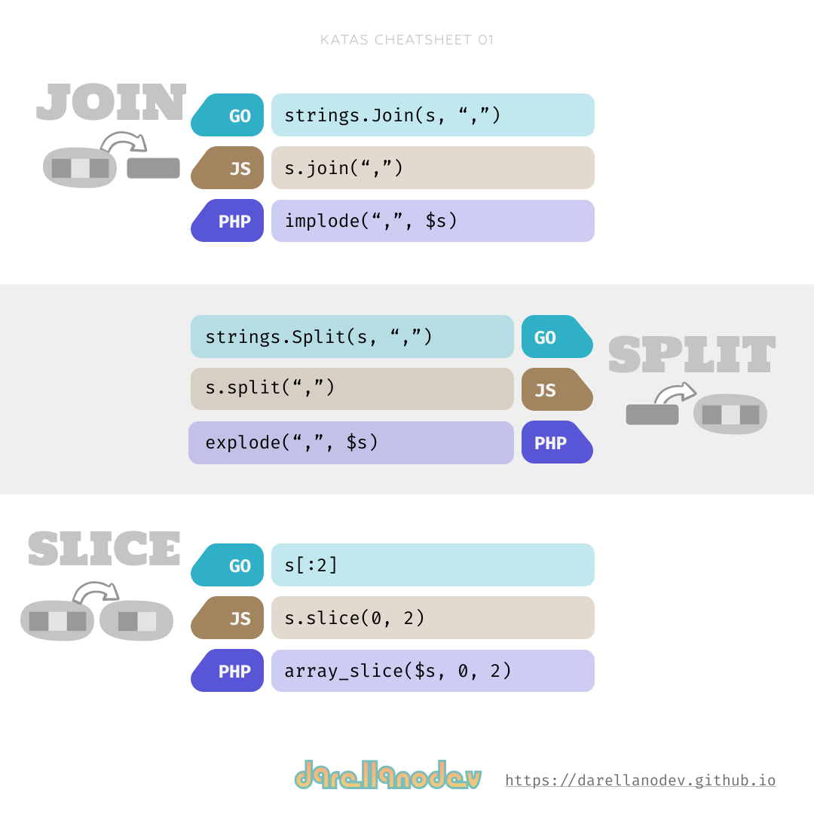
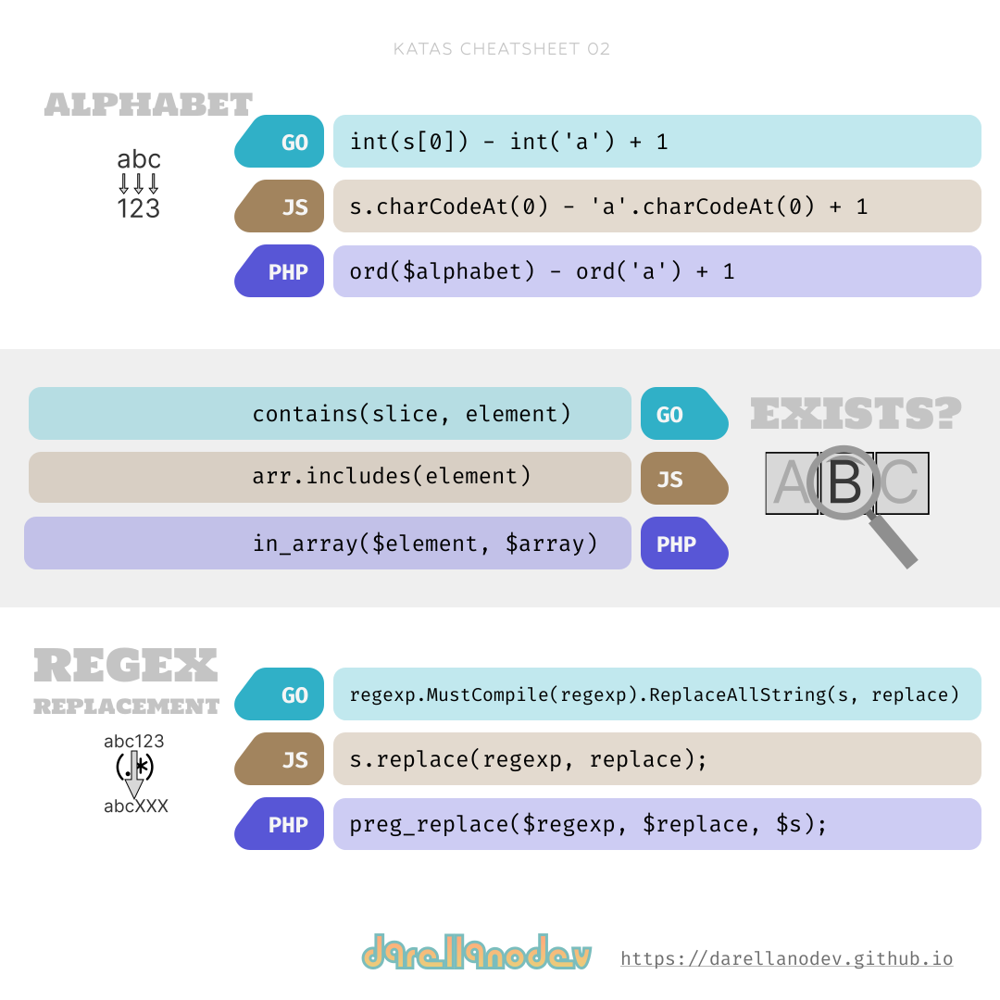

# Designs for learning

In this repository, I will share the designs I am creating to learn concepts related to programming languages and other technology topics.

## Github repository

- <https://github.com/darellanodev/designs-for-learning>

## Katas cheatsheets

